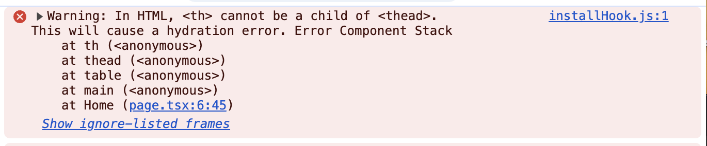
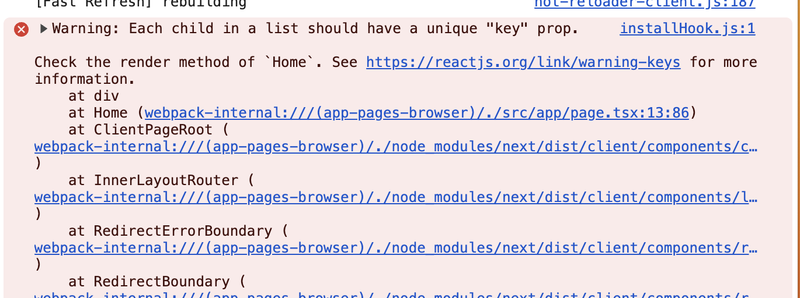

# Timeline of work

Monday 12/1/2025: Opened assignment and read through instructions.
Friday 12/5/2025 ~9:10am: Downloaded and set up git repo and started working.
Friday 12/5/2025 ~9:40am: Paused working. At this stage I am 30ish minutes in. Am needed elsewhere.
Friday 12/5/2025 ~11:00am: Started working again. DB set up.
Friday 12/5/2025 ~11:38am: Paused working. At this stage I am 1 hour 8 minutes in.
Friday 12/5/2025 ~~1:00pm: Started working again. Styling

The first thing I did was install packages and ran local dev. The console showed some errors and warnings that I cleaned up right away.

## Console Errors

`<th>` cannot be a child of `<thead>`

HTML tables, <th> elements must be wrapped in a <tr>

Each child in a list should have a unique "key" prop.

I ssumed phonenumbers are unique for each advocate.
And I asssumed specialties are unique strings.
Maybe once I set up db I can use proper keys but this clears the console error for now.

## Fix Typescript warnings
Added interface for Advocate model. JS ORMs generally now come with model to type functionality. Drizzle has this:
https://orm.drizzle.team/docs/goodies#type-api

specialties needed type which I just added in db schema.
We also had a search where we used .includes() on yearsOfExperience which is an int. Needs to be string.
Added React.ChangeEvent<HTMLInputElement> for e.
Dont kill me for casting any on document.getElement. I'll get to it later if I have time.

## DB Setup
Out of the box, we are just referencing the seed data directly. I want to use DB so that I can seed and attempt pagination solution.

First issue was getting container running. I kept seeing:

The dir for volume change in recent postgres update 16 -> 18.

Once I seeded data and pointed API GET to DB, I got a 500 error. I didnt create the advocates table correctly so it wasnt an error you introduced. This however did make me realize the need for API call error handling. I added something quick. I can refactor/make it look nice later.

Also, I want better seed data so that I can test performance and implement pagination. 

Now that I commented out DATABASE_URL in .env, I'll properly add that to gitignore.

## Styling the app

The next piece I will attack is the design of this application. I am running out of time so I just used shadcn and whatever default theme they suggested (`new-york`).
I added these:
`npx shadcn@latest add table input skeleton button`

Also remove document.getElementById and used state. Shouldnt be setting HTML directly like that.